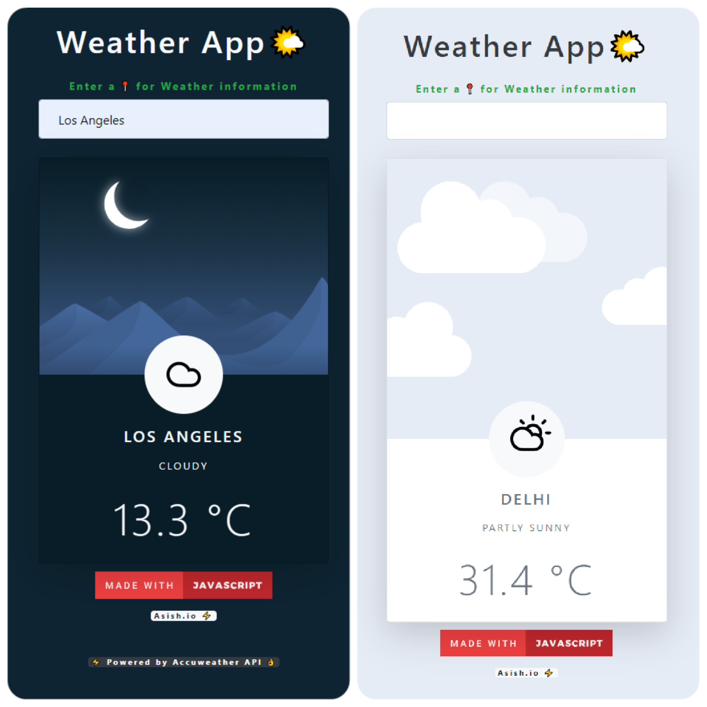

# Weather App
 Weather App made with vanilla JS using Accuweather API
### Check it out [here]!
 

 [here]:<https://asishraju.me/Weather-App/>

## Overview 👀

- A simple weather app that uses AccuWeather api to grab weather data of a city
- Minimalist design
- Frontend made with Bootstrap-4
- Stores location data on local storage for faster fetching of data

## WIP 🛠
- Use of Geo-Location browser api
- Forcast Weather Data
- Mobile APP

## How To Contribute🤝 
- Yes,it is open source you can clone and change code to your need.
- Most of the code is self explanatory, anyhow
- for any clarification on code or want to contribute contact 
- [Gmail] / [Twitter] /[LinkedIn]

[Gmail]: <mailto:vashish888@gmail.com>
[LinkedIn]: <https://www.linkedin.com/in/asish-raju-7a0b90192>
[Twitter]: <https://twitter.com/vashish888>
